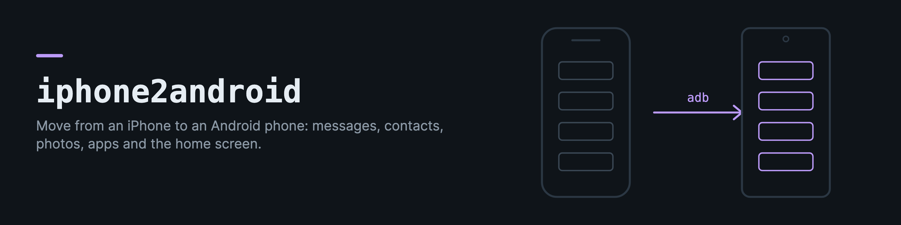

# iphone2android

iphone2android is a toolkit for moving from an iPhone to an Android phone without leaving anything behind. It is built for Claude Code to run the move, and every command also works by hand.

The official transfer (the setup wizard's "Copy apps and data", Samsung Smart Switch, OPPO Clone Phone) moves a lot, but it misses apps without an obvious match, app data, iMessage attachments, photo edits, widgets and the home screen itself. iphone2android starts from there. It reads an encrypted iPhone backup on your computer, finds what the official transfer missed, and fills the gaps on the phone over `adb`, checking each step.

What it covers:

- Finding the Android version of every iPhone app (Apple's app lookup, then the Play Store search) and installing the free ones
- Messages, call history, contacts, calendars and Safari bookmarks, converted for Android and Google
- Photos, iMessage attachments and photo edits, copied to the phone
- The data iPhone apps keep locally, found, copied, and the account names in their settings
- The home screen with its folders, order and widgets, and the iPhone wallpaper
- An audit of what the iPhone had against what the phone has, before and after

## With Claude Code

```bash
pip install iphone2android
iphone2android skill          # installs the skill into ~/.claude/skills/iphone2android
```

Then ask Claude to move you from your iPhone. The skill walks the whole move in order, starting with what has to happen before the iPhone is wiped, and Claude runs each command with `--json`, reads the result, and checks the phone with screenshots. You only do what needs your hands or your consent (the backup password, accepting terms, choosing a default SMS app).

## By hand

You need `adb` (`brew install android-platform-tools` on macOS) with USB debugging on in the phone's developer options, and an encrypted backup (Finder, select the iPhone, tick "Encrypt local backup", Back Up Now).

```bash
iphone2android backups                        # the backups on this computer
iphone2android extract --inventory            # asks for the backup password
iphone2android audit --photos                 # what the official transfer missed

iphone2android suggest                        # mapping.json, and mapping.draft.json for apps to review
iphone2android find-app "App name"            # search the Play Store by hand
iphone2android verify mapping.json
iphone2android install --mapping mapping.json

iphone2android convert --out android-import
iphone2android media message-attachments photo-edits
iphone2android appdata survey

iphone2android accounts                       # what to sign in to again

iphone2android launcher probe                 # which launcher, and which profile matches
iphone2android layout extracted/IconState.plist --mapping mapping.json > layout.json
iphone2android wallpaper extract
iphone2android build layout.json --state build.json --autofill
iphone2android check layout.json              # every page and folder against the layout
iphone2android snapshot                       # the whole home screen as JSON
iphone2android wallpaper set wallpaper/<image>
```

| File from `convert` | Import it with |
|---|---|
| `sms_backup.xml`, `calls_backup.xml` | the SMS Backup & Restore app |
| `contacts.vcf` | Google Contacts (Import) |
| `calendar.ics` | Google Calendar on the web (Settings, Import & export) |
| `safari_bookmarks.html` | Chrome on a computer (Bookmarks, Import) |

`iphone2android screenshot` and `iphone2android screen` show what is on the phone, and `iphone2android debloat` removes preinstalled apps you do not want (reversibly).

## What cannot move

- Passwords in the iCloud Keychain. Every item is sealed with a key that never leaves the iPhone, so no backup can open them. Export them with a password manager first.
- Authenticator codes. Transfer them from the authenticator app while the iPhone still works.
- Most app data. Android apps cannot read their iPhone version's files, so app data is copied out for an app's own import, a dedicated migrator (WhatsApp chats need one) or safekeeping. Apps that keep their data in an account only need signing in.
- Paid apps are not installed automatically.

## How the home screen is rebuilt

Many launchers do not let `adb` change the layout (on ColorOS the launcher database and shortcut pinning are closed without root), so the builder moves icons through the screen the way a person does. That only works with the right timings and gestures for each launcher, so they live in launcher profiles (`android/profiles/*.json`) as data, with the evidence for each. The ColorOS 16 profile was measured during a real migration on an OPPO Find X9 Pro. A few of the findings it holds:

- A swipe changes page at 250 ms and is read as a drag at 400 ms.
- A long press only opens the menu when the press, the wait and the release are sent in one adb shell.
- A drop from the app drawer always lands on the first page, so everything is made there and carried to its page by holding at the screen edge, 0.9 seconds per page.
- A slow hover merges an icon into a folder, while a 2 second drag onto an icon swaps them.
- A folder dropped onto a folder merges the two, and new folders can get the same automatic name, so folders are found by position.
- Icons cannot be dragged out of a folder, only removed inside it.

The builder follows these, reads the screen again after every step, saves its progress, checks every folder by opening it, and orders each page one swap at a time. For a launcher without a profile, the skill has a calibration procedure, and `iphone2android launcher save-profile` stores the result. Profiles for other launchers are very welcome.

Wallpapers come from the backup as images (iOS 16 and later) or Apple's `.cpbitmap` format (older versions), converted to PNG. `wallpaper set` copies the image to the phone and opens its "Set as" screen. Widgets are listed for placing through the launcher's widget picker.

## Development

```bash
python -m venv .venv && .venv/bin/pip install -e '.[test]'
.venv/bin/pytest
```

The tests use synthetic databases, a fake decryptor, fake web pages for the app stores, a fake `adb` and a simulated home screen, so they need no iPhone and no Android phone.

## License

MIT. Backup decryption uses [iOSbackup](https://github.com/avibrazil/iOSbackup) (LGPL). The cpbitmap layout follows [cpbitmap-to-png](https://github.com/hthetiot/cpbitmap-to-png) (MIT).
